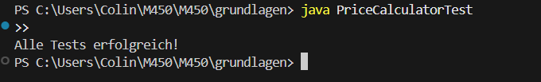

# Aufgabe 1: Testarten

## Unit-Tests (Modultests):
Testen einzelne Funktionen oder Klassen. Meist automatisiert mit Frameworks wie JUnit oder PyTest.
Beispiel: Prüfen, ob add(2,3) korrekt 5 zurückgibt.

## Integrationstests:
Überprüfen, ob mehrere Komponenten zusammen funktionieren.
Beispiel: Funktioniert die Anmeldung, wenn Login-Service und Datenbank zusammenspielen?

## Systemtests (End-to-End):
Testen das gesamte System in realistischen Szenarien. Häufig mit Tools wie Selenium.
 Beispiel: Kunde bestellt in einem Onlineshop → Warenkorb, Zahlung, Bestätigung.

# Aufgabe 2: Fehler & Mangel

## Software-Fehler (Bug):
Ein Login-Formular akzeptiert jedes Passwort, weil die Überprüfung im Code fehlt.

## Software-Mangel:
Programm erfüllt die Anforderungen nicht vollständig.
 Beispiel: Rechnungsprogramm kann nur Excel-Export, gefordert war auch PDF.

## Beispiel für hohen Schaden
NASA Mars Climate Orbiter (1999):
Wegen unterschiedlicher Masseinheiten (metrisch vs. imperial) stürzte die Sonde ab.
→ Schaden: rund 125 Millionen Dollar.

# Aufgabe 3: 



Im Beispielcode ist ein kleiner Fehler:

```
if (extras >= 3) 
    addon_discount = 10;
else if (extras >= 5)
    addon_discount = 15;
```

Die Bedingung >= 3 greift immer zuerst, also wird >= 5 nie erreicht.
Korrektur:

```
if (extras >= 5)
    addon_discount = 15;
else if (extras >= 3)
    addon_discount = 10;
```